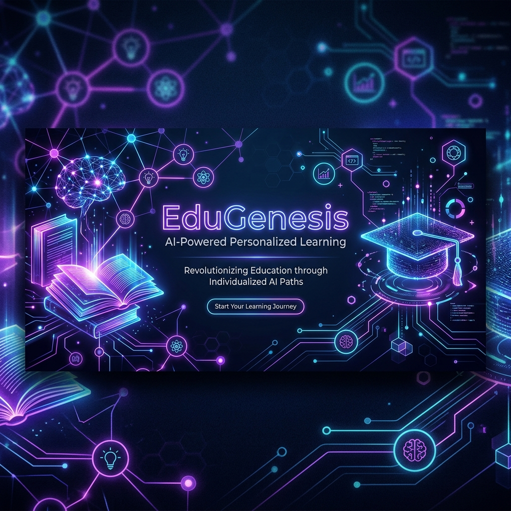

<p align="center">
  
</p>

<h1 align="center">🚀 EduGenesis (启元智学)</h1>

<p align="center">
  <strong>基于大模型的个性化资源生成与学习多智能体协同系统</strong><br>
  <i>An AI-Powered Multi-Agent Personalized Learning Platform for Higher Education</i>
</p>

<p align="center">
  
  
  
  
  
  
</p>

---

## 📌 项目背景与愿景

在高等教育场景中，不同学生在**知识基础、认知风格、学习历史和时间碎片度**等方面存在显著的个体差异。然而，传统的“标准化集体授课”教学模式难以兼顾个性化进度，导致学生吸收效率参差不齐。

**EduGenesis (启元智学)** 正是为了打破这一传统教育瓶颈而生。作为第十五届**“中国软件杯”大学生软件设计大赛 A3 赛题**（基于大模型的个性化资源生成与学习多智能体系统开发，出题企业：**科大讯飞**）的优秀参赛作品，项目依托**星火大模型**的深度推理能力，通过构建**职责链多智能体（Multi-Agent）协同架构**，结合本地高保真 **RAG (检索增强生成)** 知识库，面向高等教育学生提供动态的学习画像构建、自适应学习路径规划，以及按需流式生成的**多模态个性化教学资源**，真正让数字化时代的**“因材施教”**落地生根。

---

## 🛠️ 系统核心功能亮点

<table>
  <tr>
    <td width="50%" valign="top">
      <h3>👤 对话式动态画像构建</h3>
      <p>放弃传统的呆板表单，系统以自然语言对话的方式与学生深入交互。基于大模型抽取包含<b>知识基础、认知风格（实操/视觉/概念型）、学习目标、学习历史、易错点偏好、时间碎片度</b>等 6 个维度的精准动态学生画像，随学随新。</p>
    </td>
    <td width="50%" valign="top">
      <h3>🤖 多智能体协同资源生成</h3>
      <p>自主研发 <b>AgentCoordinator</b> 协同调度引擎。主管（Manager）、画像（Profile）、路径资源（Resource）与安全（Security）四大智能体高效协同，通过星火大模型和 RAG 在线生成高价值的多模态学术资源包。</p>
    </td>
  </tr>
  <tr>
    <td width="50%" valign="top">
      <h3>🛣️ 关卡式个性化学习路径</h3>
      <p>大模型根据学生画像，为每门课程定制科学的、可弹性调整的关卡制学习地图。明确前置与后续知识依赖，动态微调后续推送内容，将晦涩的学科体系打散为阶梯式上升的学习游戏。</p>
    </td>
    <td width="50%" valign="top">
      <h3>💻 交互式在线代码沙箱</h3>
      <p>为<b>实操型</b>学习风格量身打造。支持学生在浏览器中直接编写并运行 Python 代码，系统后台自动加载大模型进行实时语法纠错、逻辑优化和 Pytest 测试用例校验，实现理论与实践的即时闭环。</p>
    </td>
  </tr>
  <tr>
    <td width="50%" valign="top">
      <h3>🎯 动态错题诊断与精准干预</h3>
      <p>实时跟踪并记录学生在测试与代码沙箱中的表现。<b>错题智能体</b>深入分析错误根源，自动调整该薄弱点在后续路径中的复练权重，并提供量身定制的补充资源和原理剖析。</p>
    </td>
    <td width="50%" valign="top">
      <h3>🛡️ 学术防幻觉与内容安全</h3>
      <p>建立极具工业级安全的<b>双重校验机制</b>。安全智能体在资源入库前对敏感词、学术真实性、代码安全规范及 Mermaid 图表语法进行 100% 自动审计，不合规时无缝触发本地自适应兜底库，确保学术严谨与内容安全。</p>
    </td>
  </tr>
</table>

---

## 🔮 多智能体协同与 RAG 架构

系统核心的资源生成流程由 `AgentCoordinator` 主导，采用流式职责链设计，确保各智能体高度解耦与稳定容错：

```mermaid
graph TD
    classDef manager fill:#e8f4fd,stroke:#1e88e5,stroke-width:2px,color:#0d47a1;
    classDef profile fill:#f3e5f5,stroke:#8e24aa,stroke-width:2px,color:#4a148c;
    classDef resource fill:#e8f5e9,stroke:#43a047,stroke-width:2px,color:#1b5e20;
    classDef security fill:#ffebee,stroke:#e53935,stroke-width:2px,color:#b71c1c;
    classDef database fill:#fff8e1,stroke:#ffb300,stroke-width:2px,color:#ff6f00;

    A[学生触发学习关卡/手动重构] --> B(ManagerAgent 主管智能体)
    B -->|分配任务| C(ProfileAgent 画像智能体)
    
    C -->|分析用户认知风格与特征| D{认知风格匹配}
    D -->|实操型| D1["定制实操提示 (强化Pytest/Python案例)"]
    D -->|视觉型| D2["定制视觉提示 (强化Mermaid/图表组织)"]
    D -->|理论型| D3["定制概念提示 (强化文献精讲/防御编程)"]
    
    D1 & D2 & D3 -->|生成个性化 Prompt 指导项| E(ResourceAgent 路径与资源智能体)
    
    E -->|1. RAG 语义检索| F[(SQLite 课程知识库)]
    E -->|2. 在线资源生成| G[科大讯飞星火大模型 API]
    E -->|3. 精品视频推荐| H[Bilibili 视频智能检索体]
    
    G & H -->|生成多模态资源包| I["SecurityAgent 安全校验智能体"]
    
    I -->|过滤敏感词 & 验证语法合规| J{安全与学术审计?}
    J -->|通过 (YES)| K[资源入库并流式推送到前端展示]
    J -->|未通过 (NO)| L[触发降级机制: 加载本地高保真兜底库]
    
    K & L --> M[学生终端渲染渲染展示]

    class B manager;
    class C profile;
    class E resource;
    class I security;
    class F database;
```

---

## 💻 技术选型

项目采用当下主流的前后端分离架构，并在关键体验环节（流式响应、动效过渡、脑图呈现）进行了高标准的打磨：

| 层次 | 技术组件 | 作用与优势 |
| :--- | :--- | :--- |
| **前端** | React 18 & Vite | 构建极其灵敏的单页面应用，实现毫秒级的模块热替换（HMR）与打包优化 |
| | React Router DOM | 管理系统核心视图（Home、Chat、Sandbox、Achievements、Errors）的流式路由分发 |
| | GSAP (GreenSock) | 引入高品质的动画与过渡曲线，配合暗黑科技感的设计，创造 WOW 级的使用体验 |
| | Lucide Icons & Mermaid | 提供丰富的现代化矢量图标，并在前端实时高保真渲染大模型输出的 SVG 脑图 |
| **后端** | FastAPI | 高性能 Python 异步 Web 框架，自动生成 Swagger 交互式 API 文档，响应迅速 |
| | SSE (Server-Sent Events) | 实现生成式学术资源的流式输出（Streaming），彻底消除学生等待焦虑 |
| | SQLite & SQLAlchemy | 轻量嵌入式关系数据库，承载用户信息、关卡地图、错题本、以及智能体执行日志 |
| | ReportLab & PyPDF | 在后端动态生成具有排版规范、代码高亮的个性化课程讲解 PDF 文档供下载 |
| **大模型** | iFLYTEK Spark API | 科大讯飞星火大模型提供底层的知识推理、对话特征提取以及个性化真题生成能力 |

---

## 📂 项目结构

以下是项目的核心目录结构：

```
EduGenesis/
├── backend/                       # 后端核心服务 (FastAPI)
│   ├── app/
│   │   ├── agents/                # 协同智能体实现 (coordinator.py 等)
│   │   ├── ai/                    # 大模型 API 封装及 RAG 检索
│   │   ├── routes/                # 接口路由层 (认证、聊天、关卡路径、沙箱等)
│   │   ├── database/              # SQLite 数据库模型与访问逻辑
│   │   └── models.py              # Pydantic 数据模式定义
│   ├── courses/                   # 本地高校专业课程知识库数据 (Markdown 种子)
│   │   ├── python_basics/         # Python 编程基础
│   │   ├── machine_learning/      # 机器学习导论
│   │   └── calculus/              # 微积分与数学建模
│   ├── main.py                    # 后端服务启动入口 (端口 8000)
│   ├── requirements.txt           # Python 依赖清单
│   └── reseed_rag.py              # RAG 知识库一键清空与重构种子脚本
│
├── frontend/                      # 前端用户界面 (React + Vite)
│   ├── src/
│   │   ├── components/            # 业务组件 (首页、聊天画像、路径关卡、沙箱等)
│   │   ├── context/               # 全局应用上下文 (AppContext)
│   │   ├── hooks/                 # 自定义钩子 (动画、请求控制)
│   │   ├── index.css              # 全局视觉样式与 Cyberpunk 风格霓虹主题
│   │   └── main.jsx               # 应用初始化挂载入口
│   ├── package.json               # 前端 npm 依赖清单
│   └── vite.config.js             # Vite 构建配置文件
│
└── docs/                          # 项目相关配套文档与静态资源
    ├── images/                    # README 及文档所用图片 (包含 banner)
    ├── SECURITY_DESIGN.md         # 系统防侵入与安全设计方案
    └── TESTING.md                 # 系统测试规范与用例清单
```

---

## 🚀 快速安装与运行

### 前置条件
- 已安装 **Python 3.10+** 运行环境
- 已安装 **Node.js 18+** 及 **npm** 包管理器

### 1. 配置并启动后端服务 (Backend)

```bash
# 1. 克隆项目并进入后端目录
cd backend

# 2. 创建并激活 Python 虚拟环境
python -m venv venv
# Windows 激活方式：
.\venv\Scripts\activate
# macOS/Linux 激活方式：
source venv/bin/activate

# 3. 安装依赖包
pip install -r requirements.txt

# 4. 配置环境变量
# 复制配置文件模板
copy .env.example .env
# 编辑新生成的 .env 文件，填入您的讯飞星火 API 参数 (SPARK_APPID, SPARK_API_KEY, SPARK_API_SECRET)

# 5. 初始化数据库并填充 RAG 知识库种子
python reseed_rag.py

# 6. 启动后端服务器
python main.py
```
> 后端 API 将在本地 `http://127.0.0.1:8000` 运行。

---

### 2. 配置并启动前端服务 (Frontend)

```bash
# 1. 进入前端目录
cd frontend

# 2. 安装项目依赖包
npm install

# 3. 启动本地开发服务器
npm run dev
```
> 前端界面将在本地 `http://localhost:5173` 运行，打开浏览器即可体验系统。

---

## 🏆 软件杯初赛提交材料清单

根目录下已按照组委会规范准备完毕以下初赛评审文件：

* 📘 **演示PPT**：展示 EduGenesis 的创新教育价值、全套技术方案、智能体设计细节及商业前景。
* 🎥 **智能体演示视频**：7分钟内的高清视频演示，实录画像构建、多模态资源秒级流式生成及沙箱调试的全过程。
* 📝 **配套文档**：
  * [系统说明与部署指南](README.md)（即本说明文件）
  * [系统测试说明书](docs/TESTING.md)（覆盖功能测试、智能体稳定率与安全过滤校验）
  * [内容安全与防侵入方案](docs/SECURITY_DESIGN.md)（学术防幻觉与权限控制的深度设计）
