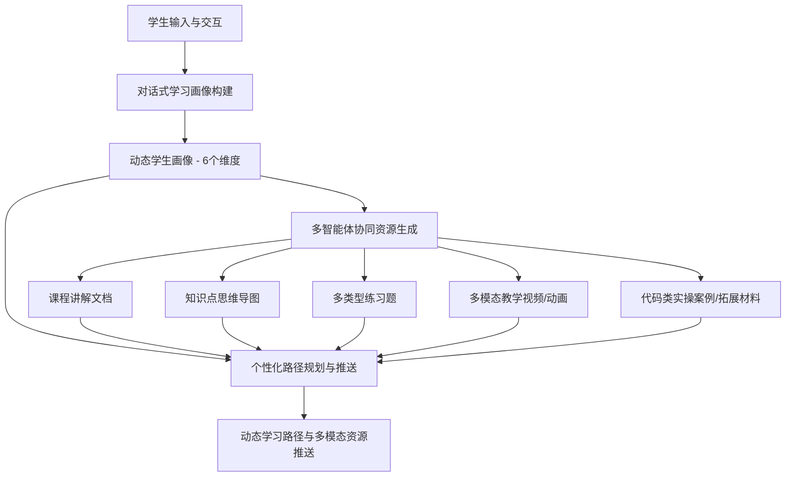

# 第十五届“中国软件杯”大学生软件设计大赛——A组赛题（A3）
## 赛题名称：基于大模型的个性化资源生成与学习多智能体系统开发

本赛题由**科大讯飞股份有限公司**出题，旨在利用通用大模型、多模态生成大模型、AI辅助编程工具等技术，构建面向高等教育的个性化学习资源体系与智能体系统，突破传统标准化教学局限，实现“因材施教”的落地。

---

## 📌 一、 赛题基本信息

| 属性 | 内容 |
| :--- | :--- |
| **赛题编号** | A3 |
| **赛题组别** | A组（本科、研究生、高职） |
| **出题企业** | 科大讯飞股份有限公司 |
| **答疑QQ群** | 1072584310 |
| **核心宗旨** | 借助大模型技术体系与前沿AI工具，突破传统教育技术与模式局限，满足学生个性化、多模态学习需求 |

---

## 🎯 二、 赛题背景与核心目标

### 1. 行业痛点与背景
* **传统模式适配性不足**：不同学生在知识基础、学习能力、兴趣方向上存在显著差异，传统的标准化教学（集体授课）难以兼顾个性化进度，导致学生吸收效率低下。
* **资源繁杂无序**：高等教育场景中，海量课程资料、学术文献、学习工具缺乏智能化组织，学生难以精准、高效地筛选契合自身当前进度和能力的资源。
* **技术演进契机**：通用大模型、多模态生成大模型（如 SeeDance 等）、AI 辅助编程工具（如 Claude Code 等）提供了强大的语言理解、多模态生成、代码辅助及实时推理能力，为高等教育个性化变革带来契机。

### 2. 核心目标
参赛团队需构建一个**高等教育个性化学习资源体系与智能学习智能体系统**。以某一具体专业课程（如人工智能、计算机、电子信息相关等）为切入点：
* 实现**个性化资源的自动化生成与建设**。
* 根据学生个体画像，提供**定制化、多模态的学习路径与内容**。
* 全方位辅助学生开展自主学习，落实数字化的**“因材施教”**。

---

## 🛠️ 三、 系统功能需求设计（分层拆解）

根据赛题要求，系统功能分为**核心基础功能**与**可选加分项**，整体呈现多智能体协同架构。

### 1. 核心功能层


#### ① 对话式学习画像自主构建
* **交互方式**：采用自然语言对话形式（避免传统繁琐的表单填写），通过与学生的交互自动抽取特征。
* **画像维度**：画像必须包含**不少于6个维度**（例如：知识基础、认知风格、易错点偏好、学习目标、学习历史、时间碎片度等）。
* **画像更新**：支持画像的“随学随新”，即根据学习过程中的实时反馈和动态表现持续迭代画像。

#### ② 多智能体协同资源生成
* **架构设计**：必须体现**多智能体（Multi-Agent）协作**架构。
* **资源类型**：基于学生画像与输入需求，由不同角色的智能体协作，生成**至少5种类型**的个性化资源：
  1. 专业课程讲解文档
  2. 知识点思维导图
  3. 不同类型练习题目（题库）
  4. 拓展阅读材料
  5. 多模态教学视频/动画
  6. 代码类实操案例/实践项目学习材料
* **多模态融合**：充分利用大模型及前沿AI生成技术（如多模态视频/动画生成）。

#### ③ 个性化学习路径规划与资源推送
* **规划逻辑**：整合生成的个性化资源，结合大模型对专业、进度、掌握情况与偏好的深度分析。
* **动态路径**：为学生量身定制科学的、动态调整的个性化学习路径，明确学习步骤与先后顺序。
* **精准推送**：基于学生画像，自动推送与之最匹配的文档、视频、题库、案例等多类型内容。

---

### 2. 可选加分功能层
> [!TIP]
> 强烈建议实现以下加分项，以增强作品在“功能实现及技术要求”维度上的竞争力（占比45%）。

#### ④ 智能辅导（可选加分项）
* **即时答疑**：当学生在学习过程中遇到疑问，系统提供即时、多模态的答疑服务。
* **多模态解答**：结合多模态生成技术，提供详细文字解答、直观图解说明、短视频讲解等多样化释疑形式。

#### ⑤ 学习效果评估（可选加分项）
* **数据跟踪**：实时跟踪并记录学生的学习行为、练习测试表现、资源使用反馈等多维数据。
* **多维评估**：利用大模型的数据分析能力，评估学生的学习效果与知识点掌握度。
* **闭环优化**：根据评估结果，实时动态微调后续的学习路径规划与资源推送策略。

---

## 💻 四、 技术实现与非功能性需求

### 1. 开发限制与工具规范
* **开发环境与语言**：不限编程语言、数据库、编译器或硬件平台。
* **多智能体框架**：框架不限（可使用开源 Agent 开发框架），但须在提交文档中明确说明框架设计，且智能体需稳定、正常运行。
* **AI 辅助工具约束**：若使用 AI 辅助工具进行开发，必须选用**科大讯飞相关工具**，并在文档中予以说明。

### 2. 界面与交互规范（现代 AI 产品规范）
* **基础交互**：界面美观简洁，逻辑清晰，无明显界面及功能错误。
* **前沿展示**：支持**流式输出（Streaming Output）**、**Markdown 渲染**、**多模态内容卡片化展示**。
* **体验优化**：引入 AI 技术智能优化交互细节；对于耗时较长的多模态生成任务，需提供“生成进度追踪”或“流式呈现”机制，避免白屏等待。

### 3. 内容安全与防幻觉机制
> [!IMPORTANT]
> 系统需具备完善的**“防幻觉”**与**“内容安全过滤机制”**，确保生成的学术内容无事实性错误，且不包含任何政治敏感或违规信息。

### 4. 依赖申报要求
* 若使用任何开源项目、前沿 AI 工具或框架，必须在提交的文档显著位置详细标注**名称、来源及相关开源协议要求**。

---

## 📂 五、 测试数据与作品提交规范

### 1. 测试数据与初始化
* **要求**：参赛团队需自行构造**至少一门完整高校专业课程**（例如人工智能、计算机科学、电子信息等相关专业课程）的初始知识库或文档集，作为系统的输入和测试依据。

### 2. 初赛作品提交清单

```
└── 提交作品根目录/
    ├── 演示PPT (展示应用价值、技术思路、创新点等)
    ├── 智能体演示视频 (7分钟以内，演示操作、核心功能与多模态效果)
    ├── 配套文档 (符合软件系统标准规范，如系统开发说明书、测试说明书)
    └── 多智能体系统可运行文件/
        ├── 项目源码
        ├── 数据集
        └── 模型部署及配置文件等
```

> [!NOTE]
> * **文档要求**：需深入进行需求分析（技术与需求的结合点），并详细阐述设计、开发、测试、部署全流程。鼓励使用系统架构图、流程图等视觉工具增强可读性。
> * **运行要求**：文件整理必须规范，确保在常规环境下能够正常部署并运行。
> * **AI Coding说明**：如开发过程中使用了 AI Coding 工具，须给出相关说明。

---

## 🏆 六、 评分标准及大致占比

赛题的评分结构侧重于**实用性、功能完整性与前沿技术的合理融合**：

```
                    █◤创新价值与实用性 (35%)
                    ████◤功能实现及技术要求 (45%)
                    █◤配套文档丰富度 (10%)
                    █◤演示视频与PPT效果 (10%)
```

1. **创新价值与实用性 (35%)**：解决高校个性化学习痛点的实际效果、多智能体协同机制的实用意义。
2. **功能实现及技术要求 (45%)**：多智能体协作生成多模态资源的丰富度与稳定性、学生画像构建的精确度、以及加分项实现。
3. **配套文档的丰富度 (10%)**：系统说明书、测试文档的规范性，技术结合点与架构阐述的清晰度。
4. **演示视频、PPT 效果 (10%)**：多模态内容与 AI 技术融合成果 of 的直观展示水平。

---
> [!WARNING]
> **著作权归属特别说明**：作品著作权归参赛团队所有；出题企业（科大讯飞）对具有市场应用及拓展空间的优秀作品拥有优先合作开发权或优先购买权。
