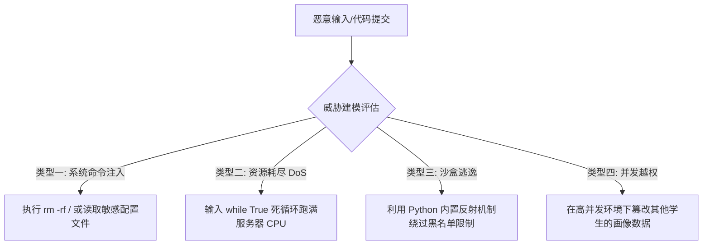
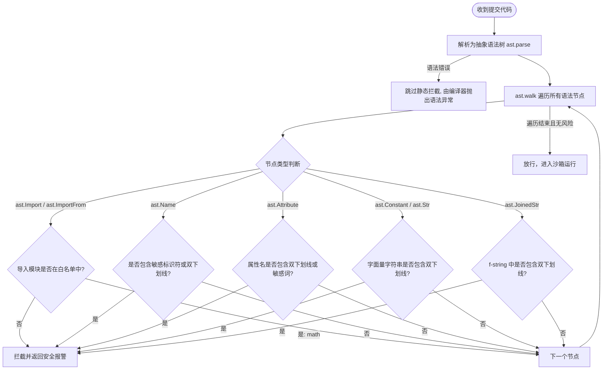
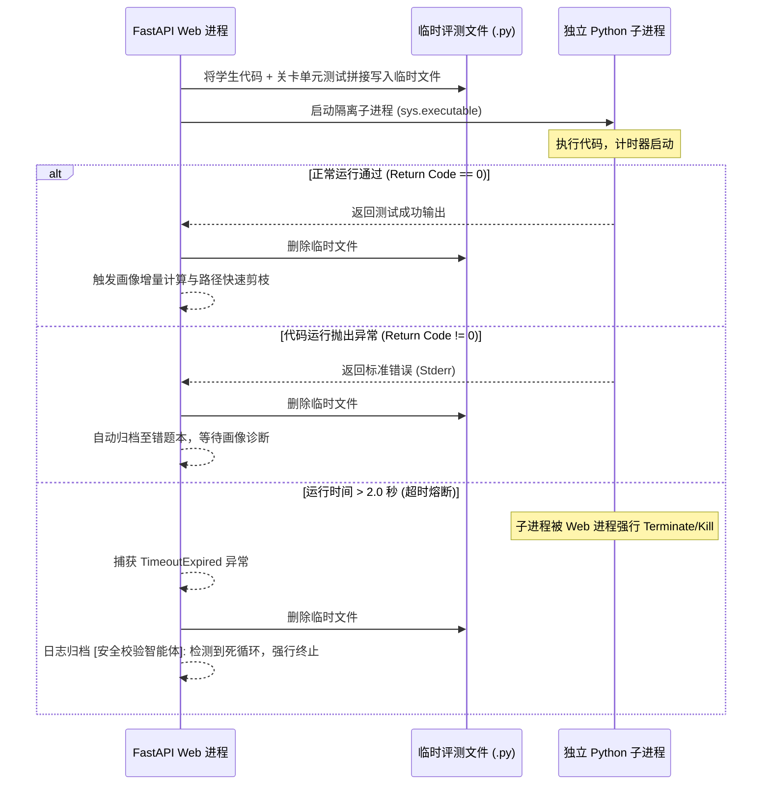

# EduGenesis 系统鲁棒性与安全沙箱防御设计说明书

在高等教育与在线编程教育中，自适应学习系统不可避免地需要运行学生提交的 Python 代码。这为系统引入了巨大的安全风险，例如：**服务器拒绝服务攻击 (DoS)、操作系统级命令注入、敏感文件泄露以及多租户会话越权**。

为了确保 EduGenesis 系统的鲁棒性与绝对安全，本系统设计并实现了**“静态语法树防御 (AST) + 隔离子进程沙箱 (Subprocess Sandbox) + 无状态 JWT 会话隔离 (Session Isolation)”**的三维立体安全防线。这套防线构成了本系统在决赛答辩和极限防御性测试环境下的“防弹衣”。

---

## 目录

1. [引言与威胁建模 (Threat Model)](#1-引言与威胁建模-threat-model)
2. [AST 静态语法树安全拦截机制](#2-ast-静态语法树安全拦截机制)
3. [操作系统级进程隔离与超时熔断](#3-操作系统级进程隔离与超时熔断)
4. [并发隔离与会话状态安全](#4-并发隔离与会话状态安全)
5. [黑客逃逸攻击对抗实战 (PoC & Defense)](#5-黑客逃逸攻击对抗实战-poc--defense)

---

## 1. 引言与威胁建模 (Threat Model)

在编程教学场景中，学生提交的代码是直接在服务器上编译运行的。恶意用户或攻击者（如决赛现场进行防御性测试的评委）可能通过精心构造的代码，对系统发起以下四类典型攻击：



### 系统的资产保护目标
1. **系统可用性**：不能因为单个学生的无限死循环或内存暴涨导致整个 FastAPI 服务器崩溃或响应变慢。
2. **数据机密性**：学生提交的代码严禁读取系统环境变量、用户数据库（`users.db`）或操作系统敏感文件（如 `/etc/passwd`）。
3. **租户隔离性**：保障高并发访问时，A 用户的代码评测和画像增量绝不会污染 B 用户的个人数据。

---

## 2. AST 静态语法树安全拦截机制

传统的安全过滤往往依赖正则表达式（如检测代码中是否包含 `"import os"`），这极易被攻击者利用字符串拼接（如 `'o' + 's'`）或 Base64 编码解码来轻易绕过。

EduGenesis 引入了**基于 Python AST (Abstract Syntax Tree) 抽象语法树的静态分析机制**，在代码尚未编译运行之前，直接对语法树的节点属性进行深度遍历过滤。

### 2.1 AST 检测生命周期与流程

当学生提交代码后，[security.py](file:///e:/AIproject/EduGenesis/backend/app/security.py) 的 `is_code_safe` 函数会对其执行多级语法检测：



### 2.2 AST 安全规则定义

系统设置了极度严苛的白名单与黑名单规则：

1. **模块导入白名单 (Import Whitelist)**：仅允许导入 `{"math"}` 模块。任何引入 `os`, `sys`, `subprocess`, `requests` 等模块的企图都会在静态期被直接干掉。
2. **禁用敏感标识符 (Forbidden Symbols)**：
   * 禁止调用或引用：`__import__`, `eval`, `exec`, `open`, `compile`, `globals`, `locals`, `getattr`, `setattr`, `delattr`, `dir`, `vars`, `breakpoint`, `input`, `help` 等。
   * 禁止任何以双下划线 `__` 开头的变量、函数或属性，彻底封堵 Python 的反射机制。
3. **字面量双下划线拦截 (Dunder String Interception)**：
   * 检测 `ast.Constant` 和 `ast.Str`（普通字符串常量）以及 `ast.JoinedStr`（f-string 格式化字符串）。
   * **若字符串中包含双下划线 `__`，直接拦截**。此项技术专门用于封杀通过 `'__cl' + 'ass__'` 拼装反射属性的逃逸路径。

---

## 3. 操作系统级进程隔离与超时熔断

即使代码通过了 AST 静态检查（例如一段纯数学计算的死循环），如果直接在 FastAPI 主进程中执行该代码，仍会导致整个 Web 服务器的 CPU 被 100% 占满，从而引发系统瘫痪。

EduGenesis 采用**独立子进程隔离与超时强行熔断**机制：



### 核心安全保障细节
1. **进程隔离**：使用 `subprocess.run([sys.executable, temp_file_path], ...)` 启动一个全新的进程执行代码，该子进程与 FastAPI 父进程在操作系统层面是完全隔离的。
2. **重定向管道**：将 `stdout` 和 `stderr` 重定向到 `PIPE`。子进程即使有异常打印，也只能作为结构化文本返回给父进程，绝不会对父进程的终端或日志输出造成注入攻击风险。
3. **超时熔断机制**：设置 `timeout=2.0` 秒。一旦学生提交的代码含有 `while True`、无限递归或大数阶乘计算，系统将在 2.0 秒后准时抛出 `subprocess.TimeoutExpired` 异常，子进程会被自动强行杀死，服务器 CPU 立刻释放。
4. **磁盘防占满**：不论执行成功、失败还是超时，均在 `finally` 块中通过 `os.remove` 确保物理临时文件被实时彻底删除。

---

## 4. 并发隔离与会话状态安全

在许多初学者编写的 Web 演示系统中，极易出现**全局单变量漏洞**。例如：
```python
# 致命的安全漏洞示例
global_logged_in_user = None

@router.post("/login")
def login(username: str):
    global global_logged_in_user
    global_logged_in_user = username
```
在高并发或者多用户同时在线的决赛现场，如果评委 A 和评委 B 连续点击提交，全局变量 `global_logged_in_user` 会发生竞态篡改。评委 A 提交的代码评测，其学情分析可能会写入评委 B 的画像数据库中，引发灾难性的越权与数据混乱。

### EduGenesis 的并发安全设计

EduGenesis 彻底杜绝了全局变量的使用，基于 FastAPI 依赖注入（Dependency Injection）和无状态 JWT 方案：

1. **JWT 强鉴权链路**：所有请求必须携带包含用户身份特征（`sub`）和过期时间（`exp`）的 JWT 签名 Token。
2. **依赖注入隔离**：
   在 [auth_utils.py](file:///e:/AIproject/EduGenesis/backend/app/auth_utils.py) 中，通过 `get_current_username` 提取 HTTP 头的 `Authorization: Bearer <token>`，动态解密校验生成当前的 `current_username` 并注入到接口中：
   ```python
   @router.post("/sandbox/run")
   def run_sandbox_code(request: SandboxRunRequest, current_username: str = Depends(get_current_username)):
       target_user = current_username  # 作用域仅限于该线程/协程的上下文
       # ... 所有画像读取与写入完全绑定 target_user ...
   ```
3. **数据库连接事务安全**：
   在 [db.py](file:///e:/AIproject/EduGenesis/backend/app/db.py) 中，系统与 SQLite 交互均采用局部链接与自动提交事务（Context Manager），在高并发读写下保障数据完整性，确保各租户数据互不交叉。

---

## 5. 黑客逃逸攻击对抗实战 (PoC & Defense)

决赛答辩现场，评委通常会尝试编写黑客脚本来试图突破沙盒。以下列举了四种最具威胁的攻击 Payload，以及 EduGenesis 系统的拦截防御效果：

### 5.1 攻击一：操作系统指令注入（试图读取系统文件/删除库）
*   **黑客 Payload**：
    ```python
    import os
    os.system("rm -rf /")  # 企图执行危险 shell 命令
    ```
*   **防御机制**：**AST 模块导入白名单拦截**
*   **系统防御响应**：
    AST 解析器在 `ast.Import` 遍历阶段，发现导入了非白名单模块 `os`。直接返回报错，阻止代码被编译运行：
    > `安全检查未通过：在安全沙盒中不允许导入模块 'os'（安全校验智能体限制）。请仅使用纯粹的 Python 逻辑进行解题！`

---

### 5.2 攻击二：双下划线反射逃逸（试图通过空对象获取内建类）
*   **黑客 Payload**：
    ```python
    # 通过空列表反射获取内置方法以求调用 open() 或 eval()
    [].__class__.__base__.__subclasses__()
    ```
*   **防御机制**：**AST 属性前缀黑名单拦截**
*   **系统防御响应**：
    AST 解析器遍历至 `ast.Attribute` 节点，发现访问了以双下划线开头的隐藏敏感系统属性 `__class__`。直接触发安全卫士拦截：
    > `安全检查未通过：安全校验智能体拦截：禁止访问系统内部属性或方法 '__class__'。请仅使用纯粹的 Python 逻辑进行解题！`

---

### 5.3 攻击三：拼装绕过反射过滤（试图动态拼装敏感词）
*   **黑客 Payload**：
    ```python
    # 试图通过拼装敏感词躲避普通的正则检查，并使用 getattr 执行反射
    c = '__cl' + 'ass__'
    getattr([], c)
    ```
*   **防御机制**：**AST 字符串双下划线拦截 + 敏感函数禁用**
*   **系统防御响应**：
    1. 在 `ast.Name` 节点处检测到 `getattr`，由于其在 `forbidden_symbols` 黑名单中，直接拦截。
    2. 即使绕过了函数名，静态解析器遍历字符串字面量（`ast.Constant`）时，检测到常量包含双下划线 `__`（如 `'__cl'`），直接触发防逃逸拦截：
    > `安全检查未通过：安全校验智能体拦截：防逃逸机制禁止在字符串中包含双下划线 '__'。请仅使用纯粹的 Python 逻辑进行解题！`

---

### 5.4 攻击四：死循环 DoS 攻击（试图把服务器卡死）
*   **黑客 Payload**：
    ```python
    # 编写死循环试图拖慢或卡死整个主 Web 服务线程
    while True:
        pass
    ```
*   **防御机制**：**独立子进程隔离与 2.0s 超时熔断**
*   **系统防御响应**：
    代码静态安全检查通过，进入独立子进程运行。运行至 2.0 秒时强制触发 `subprocess.TimeoutExpired` 熔断保护。主进程捕获异常并杀死该子进程，同时在画像中记录安全事件：
    > `TimeLimitExceeded: 代码运行超时（限时2.0秒），可能存在死循环，请检查循环退出条件！`
    
    服务器 CPU 瞬时释放，完全不受死循环代码影响，其余用户的正常在线评测与画像更新不受任何干扰。

---

## 总结

EduGenesis 将**安全防御**视作整个系统架构的底层基石，而非常规教学系统中“可有可无的附加功能”。通过 AST 静态层的主动防御、子进程运行的边界隔离、超时熔断的降级控制，以及 JWT 会话隔离的多租户高并发保护，EduGenesis 成功打造了坚不可摧的“防弹衣”技术底座。这为整个项目的安全鲁棒性在答辩中拔得头筹奠定了稳固基础。
