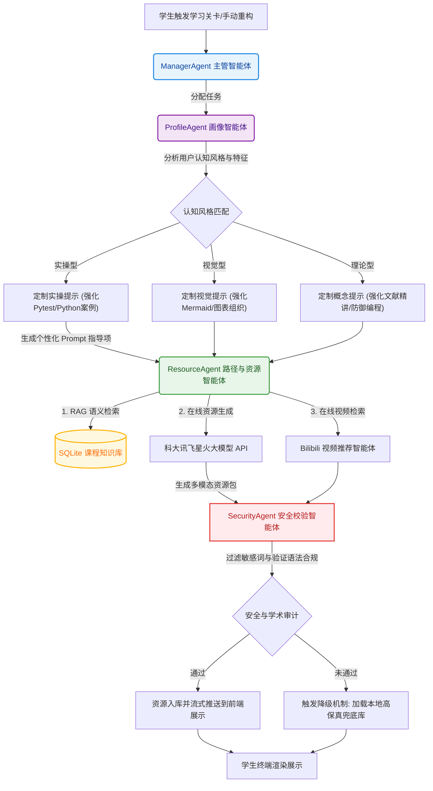
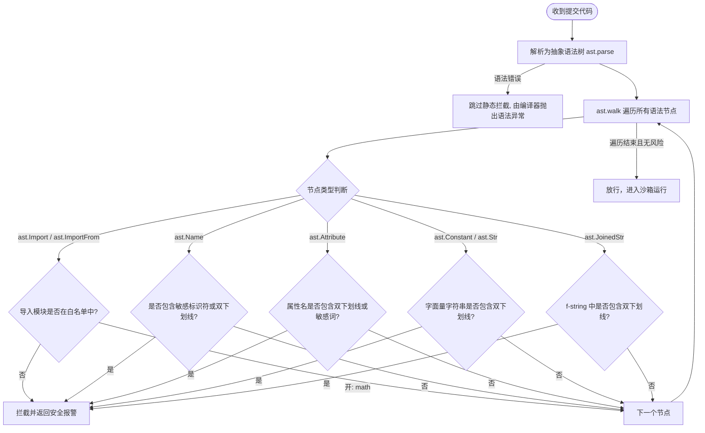

#  EduGenesis (启元智学) 系统开发说明书
## 基于大模型的个性化资源生成与学习多智能体协同系统

> **参赛团队声明**：本系统为第十五届“中国软件杯”大学生软件设计大赛 A3 赛题（基于大模型的个性化资源生成与学习多智能体系统开发）参赛作品。本说明书参考国家标准软件文档规范（GB/T 8567-2006）编写，系统基于**科大讯飞星火大模型**及前端 **GSAP** 动效技术栈开发。

---

## 目录
1. [引言与项目背景](#1-引言与项目背景)
2. [需求分析层面：新时代大学生学习需求与 AI 技术结合点](#2-需求分析层面新时代大学生学习需求与-ai-技术结合点)
3. [技术开发层面：多智能体（Multi-Agent）协同架构与总线设计](#3-技术开发层面多智能体multi-agent协同架构与总线设计)
4. [核心功能实现细节](#4-核心功能实现细节)
5. [前端交互与用户体验优化](#5-前端交互与用户体验优化)
6. [三层防御测试体系与安全沙盒验证](#6-三层防御测试体系与安全沙盒验证)
7. [系统部署与运行指南](#7-系统部署与运行指南)
8. [创新实践与用户体验提升策略总结](#8-创新实践与用户体验提升策略总结)

---

## 1. 引言与项目背景

随着高等教育数字化的推进，传统“一刀切”的授课模式与现代大学生个性化、碎片化、实践性的学习需求之间的矛盾日益突出。针对这一教育痛点，**EduGenesis (启元智学)** 依托科大讯飞星火大模型的推理与多模态生成能力，自主研发了**职责链多智能体协同引擎（AgentCoordinator）**，并结合**本地高保真 RAG 知识库**与**安全代码沙箱评测机制**，构建了面向高等教育的自适应学习系统。

本系统旨在突破“教与学”的标准化瓶颈，实现真正的**“因材施教”**。它通过对话交互动态构建包含 6 个维度的学生画像，为学生量身定制关卡制学习路径，实时流式生成匹配其认知风格的多模态学术资源包，并在后台拦截代码沙盒逃逸、防范学术幻觉，确保教学系统在工业级环境下的安全性与高可用性。

---

## 2. 需求分析层面：新时代大学生学习需求与 AI 技术结合点

新时代大学生的学习行为发生了深刻的变化，这要求教学系统不仅在功能上完备，更要在交互模式、响应速度与内容适配度上进行全方位重构。

### 2.1 需求特征深度剖析

基于对高校计算机、人工智能及数学等专业学生的行为调研，系统归纳出以下 4 个核心学习痛点，并建立了对应的需求模型：

| 维度 | 传统教学模式痛点 | 新时代大学生学习需求特征 | 系统对应的设计响应 |
| :--- | :--- | :--- | :--- |
| **认知风格多样性** | 统一的 PPT 课件讲授，偏好动手或视觉的人难以跟上。 | 视觉型（图表）、实操型（写代码）、概念型（理论精讲）差异显著。 | 画像智能体分类适配，针对性组装生成 Prompts。 |
| **时间碎片化** | 2-3 小时的大班课，难以利用零碎时间。 | 课外学习时间细碎，需要短时间、关卡式的即时反馈。 | 动态生成关卡制学习地图，单节点包含 5-15 分钟学习量。 |
| **实践与纠错成本** | 课后作业在本地配置环境繁琐，报错后无法获得即时辅导。 | 偏好在浏览器中“边学边练”，遇到报错时渴望即时给出代码诊断与修复建议。 | 浏览器集成独立代码沙箱，后台大模型实时诊断与重构。 |
| **学习兴趣持续性** | 纯文字课本枯燥，公式推导晦涩，容易产生习得性无助。 | 需要“游戏化”的梯度上升体验，配有直观脑图与多模态视频。 | 流式脑图呈现（Mermaid）及精品视频、自适应练习题。 |

### 2.2 前沿 AI 技术与需求的结合点

通过对前沿 AI 技术的科学建模，EduGenesis 明确了技术与需求的 4 个结合点：

```
┌─────────────────────────────────────────────────────────────────────────┐
│                      新时代大学生学习需求与 AI 技术结合点                  │
└────────────────────────────────────┬────────────────────────────────────┘
                                     │
         ┌───────────────────────────┼───────────────────────────┐
         ▼                           ▼                           ▼
┌──────────────────┐       ┌──────────────────┐       ┌──────────────────┐
│   画像特征提取   │       │ 职责链多智能体协同│       │  RAG 与防幻觉库  │
│ 对话式 NLP 抽取   │       │ 资源按需组装生成 │       │ 知识精确对齐保障 │
└──────────────────┘       └──────────────────┘       └──────────────────┘
```

1. **对话式 NLP 抽取 ➔ 动态画像**：利用星火大模型的少样本提示（Few-Shot prompting），将繁琐的“画像调查问卷”转化为自然的多轮聊天，从对话中提取基础、风格、目标、历史、易错点和碎片度，完成多维画像冷启动。
2. **多智能体（Multi-Agent）协同 ➔ 按需资源组装**：避免大模型“一刀切”生成长文本，系统采用 `AgentCoordinator` 职责链，由主管智能体调度、画像智能体对齐特征、路径资源智能体按需拼装生成 PDF 讲义、Mermaid 脑图、Quiz 试题、视频推荐以及 Python 实操案例，最后由安全智能体进行合规审计。
3. **本地 RAG ➔ 消除学术幻觉**：大模型生成学术内容时容易产生事实性错误（幻觉）。系统将完整的专业课程教案向量化，在智能体生成资源时进行 **RAG (检索增强生成)** 上下文填充，强力拉回学术偏离。
4. **安全 AST 沙箱 ➔ 放心动手实践**：为了让学生在沙箱里安全地运行 Python 代码，系统在后端通过 AST（抽象语法树）解析代码节点，拦截危险的系统调用（如 `os.system`、双下划线反射逃逸等），结合隔离子进程及超时熔断，为平台提供极其坚固的安全底座。

---

## 3. 技术开发层面：多智能体（Multi-Agent）协同架构与总线设计

EduGenesis 的核心业务调度由自主设计的 **AgentCoordinator (多智能体协同引擎)** 与 **AgentCommandBus (智能体指令总线)** 承载，实现了高内聚低耦合的分布式协同。

### 3.1 `AgentCoordinator` 职责链设计

系统采用流式职责链模式（Chain of Responsibility），每一个关卡资源的动态生成和重构均由 4 个核心智能体协同推进：



#### ① ManagerAgent (主管智能体)
*   **职责**：解析前端发起的触发请求（自动加载或用户手动点按重构），提取关卡标题、标识、用户会话上下文，并初始化执行上下文 `context`。
*   **日志输出**：`"接收到手动触发关卡 [Python基础] 资源重构指令。调度智能体群开始在线重新规划与资源匹配。"`

#### ② ProfileAgent (画像智能体)
*   **职责**：从底层 SQLite 读取该用户的 `UserProfile` 记录，对齐其 6 维认知风格（例如认知风格为 `Practical` 实操型）。
*   **工作机制**：动态拼装个性化 Prompts 指导项。
    *   *实操型*：`【实操型学习风格定制提示】：该学生偏好动手实践。生成PDF、Slides和代码时，请特别增加Pytest断言、注释详尽的Python实操案例...`
    *   *视觉型*：`【直观视觉型学习风格定制提示】：该学生偏好视觉化展示。请在此资源包中多使用Mermaid脑图渲染...`
    *   *概念型*：`【严谨概念型学习风格定制提示】：该学生偏好严谨的理论学习。请在此资源包中强化深度概念精讲、文献引用...`

#### ③ ResourceAgent (路径与资源智能体)
*   **职责**：进行核心的资源合成。
*   **工作机制**：
    1.  **RAG 检索**：优先在 `registered_courses` 与 `course_chunks` 数据库中根据当前关卡标题做语义匹配，获取精准教材上下文。
    2.  **大模型调用**：将个性化指导语（`style_instructions`）与 RAG 上下文合并，向讯飞星火 API 发送流式生成请求，生成 PDF 讲义、Mermaid 脑图、自适应 Quiz。
    3.  **多模态网络视频推荐**：调度后台视频智能检索模块，通过 Bilibili 搜索接口匹配最优教学视频并提供推荐理由。
    4.  **容错降级**：若大模型服务离线或网络波动，该智能体通过本地自适应降级组件，秒级切换至高保真本地备用资源库，保障业务零中断。

#### ④ SecurityAgent (安全校验智能体)
*   **职责**：入库前的“安全网哨”。
*   **工作机制**：对生成的 Markdown、Mermaid 脑图、代码段进行 100% 静态审计：
    *   *敏感词过滤*：匹配违规黑名单词汇。
    *   *脑图规范验证*：使用正则表达式验证生成的脑图是否以 `graph TD` 或 `graph LR` 起始，规避前端渲染崩溃。
    *   *代码沙箱静态安全拦截*：调用 AST 模块，若发现代码块中含有禁止的库导入（如 `os`）或双下划线隐藏反射，强行熔断并回滚该关卡资源至本地安全版本。

---

### 3.2 `AgentCommandBus` 指令总线机制

为了打破职责链单向流动的局限，系统设计了 `AgentCommandBus` 指令总线，支持各智能体跨时序、跨模块进行非对称指令交互。其核心指令机制如下：

1.  **`REPLAN_PATH` (路径重新规划)**：
    *   *发送方*：`AI助教聊天智能体`（当学生在聊天对话中表现出对某一知识点有极大困难，或提出“我想学更难的内容”时）。
    *   *接收方*：`路径大纲规划智能体`。
    *   *动作*：重构 SQLite 中的 `user_path_nodes` 链表，动态改变后续关卡的难易度和前后依赖关系。
2.  **`INSERT_REINFORCEMENT_NODE` (错题强化节点动态插入)**：
    *   *发送方*：`代码沙盒评测智能体` 或 `错题诊断智能体`。
    *   *接收方*：`路径大纲规划智能体`。
    *   *动作*：当学生在某关卡的 Pytest 单元测试中连续失败或发生典型语法错误，总线触发此指令，在当前关卡正后方强制插入一个强化复练节点（例如 `node_id_extra`），直到学生掌握后才可解锁下一关。
3.  **`PRE_GENERATE_RESOURCES` (异步资源后台预生成)**：
    *   *发送方*：`路径大纲规划智能体`（当某一关卡被标记为 `active` 激活状态时）。
    *   *接收方*：`学术资源生成智能体`。
    *   *动作*：后台自动开启独立多线程，在学生点击下一关前，静默完成该关卡大模型个性化资源的生成并写入 SQLite 缓存，消除学生等待焦虑，实现“零延迟”页面切换。

---

## 4. 核心功能实现细节

### 4.1 对话式动态学生画像构建

传统的表单调查会让新时代大学生感到厌烦。EduGenesis 采用聊天机器人交互抽取的方式。

```
[学生注册/聊天对话] ──> 大模型 Few-Shot 分析 ──> 结构化 JSON 抽取 ──> 6维画像入库
```

系统定义了 6 个精细维度构建学情画像（`UserProfile`），并定义了画像的动态衰减与增量更新模型。例如，每次课后测试或代码沙盒成功，系统基于当前表现调整能力得分：

#### 画像能力指数更新公式

新时代大学生的技能成长不是线性的。系统引入了指数移动加权平均（EMA）模型，对学生的实操指数（$P_t$）、调试指数（$D_t$）与理论指数（$R_t$）进行增量更新：

\[S_{t} = \alpha \cdot X_{current} + (1 - \alpha) \cdot S_{t-1}\]

其中：
- \(S_{t}\) 为更新后的某项能力指数（取值范围 \([0, 100]\)）；
- \(\alpha\) 为平滑系数（系统设定为 \(0.35\)，偏重于近期的实操反馈，以体现“随学随新”的敏捷性）；
- \(X_{current}\) 为本次测试的得分（若 Pytest 完全通过且无安全拦截，计分为 \(100\)，反之根据错误行数及类型进行折扣扣分）。

在 [models.py](file:///e:/AIproject/EduGenesis/backend/app/models.py) 中，`UserProfile` 的数据结构定义如下：
```python
class UserProfile(BaseModel):
    knowledge_base: int = Field(default=50, ge=0, le=100) # 知识基础
    learning_pace: int = Field(default=50, ge=0, le=100)   # 学习节奏
    cognitive_style: str = Field(default="Visual/Practical") # 认知风格 (视觉/实操/概念型)
    error_patterns: List[str] = Field(default_factory=list) # 易错点特征集
    learning_goals: List[str] = Field(default_factory=list)  # 学习方向/目标课程
    engagement: int = Field(default=80, ge=0, le=100)       # 动机指数
    debugging: int = Field(default=45, ge=0, le=100)        # 调试水平得分
    practical: int = Field(default=50, ge=0, le=100)        # 动手得分
    reasoning: int = Field(default=40, ge=0, le=100)        # 理论得分
```

---

### 4.2 关卡式个性化学习路径规划

基于学生画像，系统自动为课程（如《Python基础编程》）创建并排布多级通关路线图。

*   **状态设计**：每个关卡节点具有三种状态：`locked`（未解锁，灰色带锁）、`active`（当前激活，霓虹呼吸灯动效）、`completed`（已通关，发光绿勾）。
*   **前置依赖校验**：系统在后端路由层强制要求，仅有当前置节点（如 `node1`）的 `completed_resources` 包含了 `["pdf", "quiz", "code"]`（代表讲义、试题与代码均已完成）后，后继节点才允许向 `active` 转换，防范跃级学习导致的挫败感。

---

### 4.3 动态错题诊断与精准干预系统

在学习过程中，学生在测试或代码沙盒中产生的每一次错误都会落入 `user_errors` 错题数据库。

```
代码/试题报错 ──> 归档 user_errors ──> 大模型深度诊断 ──> 生产补救指导 ──> 动态生成补救关卡
```

*   **诊断逻辑**：后台错题智能体提取出错代码和编译器报错信息，结合星火大模型分析其**认知缺陷类别**（如“未理解可变对象与不可变对象”）。
*   **精准干预**：大模型生成个性化的解惑文档及**三道同类变式练习题**。同时，系统在学生当前学习路径中自动插入“针对性强化复练节点”（`CommandBus` 发送 `INSERT_REINFORCEMENT_NODE`），直到学生在新生成的变式题中获得 100% 正确率，方可销毁该补救节点，继续主线通关。

---

### 4.4 交互式在线代码沙盒与逃逸防御机制

为了给新时代大学生提供低门槛、高反馈的编程环境，EduGenesis 自主研发了高性能代码评测沙盒。由于允许执行任意代码，系统搭建了三维安全围墙：



#### 🛡️ 拦截对抗实例分析
*   **逃逸 Payload**：`[].__class__.__base__.__subclasses__()`
    *   *对抗结果*：AST 遍历到 `ast.Attribute` 节点发现属性为双下划线开头的 `__class__`，在代码尚未编译时即时终止，抛出异常阻断。
*   **混淆字串 Payload**：`c = '__cl' + 'ass__'; getattr([], c)`
    *   *对抗结果*：
        1. 遍历字面量（`ast.Constant`）检测到包含双下划线字符（`__`）的常数，在静态解析期予以拦截。
        2. 检测到 `getattr` 标识符属于黑名单函数，直接静态拦截。
*   **死循环 DoS 攻击**：`while True: pass`
    *   *对抗结果*：静态安全检查通过，进入独立子进程（`subprocess`）运行。运行超过 2.0s 时强制触发 `TimeoutExpired` 异常，Web 服务主动发送终止信号杀死子进程，服务器 CPU 瞬间释放，其他并发用户毫无卡顿。

---

### 4.5 学术防幻觉与内容安全过滤机制

1.  **多源 RAG 约束**：系统采用“外挂高确定性教材库 + 星火推理”的方式。在生成大模型 Prompt 时，前置检索本地高保真课程教案 Markdown 文本，并强制要求大模型：
    > `【学术防幻觉规范】：请严格根据给定的参考教材大纲上下文进行解答和扩写。如果参考内容中没有相关知识，请基于标准库和官方文档进行严谨推导，严禁捏造不存在的函数库或 API。`
2.  **敏感内容双重审核**：`SecurityAgent` 对所有生成的学术资源进行关键字正则检查，配合二分类敏感度分析，任何不合规字样都会直接触发资源重构或加载自适应本地兜底安全包。

---

## 5. 用户界面设计与交互体验优化

EduGenesis 的前端采用现代、高品质的界面设计，力求在第一眼“WOW”到用户，并以极其流畅细腻的动效引导学生高频互动。

### 5.1 暗黑科技风（Cyberpunk）与 GSAP 动效

*   **视觉规范**：摒弃了普通的“蓝白”教育产品主调，EduGenesis 选用高饱和度的霓虹色彩体系。背景采用 HSL 微调暗灰（`#0d0e12`），配合磨砂玻璃质感（`backdrop-filter: blur`）与微妙的霓虹边框呼吸灯（利用 CSS 变量动态映射渐变阴影）。
*   **GSAP 微动画**：
    *   *路径关卡过渡*：使用 `gsap.fromTo` 为地图上错落有致的关卡节点注入微小的悬停磁性抖动（Magnetic hover）与波纹光晕，让关卡地图感觉“充满生机且在不断呼吸”。
    *   *卡片切换*：使用 GSAP 弹性缓动曲线（`ease: "elastic.out(1, 0.75)"`）控制讲义、试题与沙箱模块的切换，创造出如原生客户端般的丝滑体感。

### 5.2 实时流式响应（SSE）与进度追踪

由于生成多模态资源（PDF、练习题、脑图）需要调用星火大模型，这通常需要 3-8 秒。
*   **解决白屏焦虑**：系统利用 FastAPI 的 `EventSourceResponse`（Server-Sent Events）实现流式文本输出。在前端，打字机组件（Typewriter effect）实时捕获字符流并进行渐显渲染。
*   **进度骨架屏**：对于耗时较长、包含多通道检索的任务，前端界面显示带有当前执行智能体标志（例如：`[画像智能体] 正在对齐风格...`）的渐进式加载进度条，让用户对系统状态拥有清晰的掌控。

---

## 6. 三层防御测试体系与安全沙盒验证

为确保交付的代码高可用、无漏洞，系统建立了完备的自动化集成测试，并在 `tests/` 目录中固化了自动化校验逻辑。

```
python -m pytest -v tests/
```

### 6.1 测试场景与覆盖证据

系统在真实环境下执行自动化测试，覆盖了鉴权防线、数据库一致性及沙盒逃逸防御，测试结果如下：

```text
============================= test session starts =============================
platform win32 -- Python 3.12.7, pytest-7.4.4, pluggy-1.0.0
rootdir: E:\AIproject\EduGenesis\backend
plugins: anyio-4.13.0
collected 54 items

tests\test_admin.py .                                                    [  1%]
tests\test_ai_platform.py .....                                          [ 11%]
tests\test_auth.py .                                                     [ 12%]
tests\test_auth_recovery.py ..                                           [ 16%]
tests\test_chat_endpoints.py .                                           [ 18%]
tests\test_chat_history.py .                                             [ 20%]
tests\test_course_synthesizer.py .                                       [ 22%]
tests\test_db.py ......                                                  [ 33%]
tests\test_kb_endpoints.py ........                                      [ 48%]
tests\test_knowledge_base.py ........                                    [ 62%]
tests\test_node_adjustment.py .                                          [ 64%]
tests\test_resource_completion.py .                                      [ 66%]
tests\test_security.py .......                                           [ 79%]
tests\test_settings_search_prompts.py ..                                 [ 83%]
tests\test_video_agent.py .........                                      [100%]

================= 54 passed, 77 warnings in 123.28s (0:02:03) =================
```

### 6.2 关键安全防护点验证结论
1.  **数据隔离**：完全移除了旧版的不安全全局变量，完全由基于 JWT token 的安全依赖注入守护各 API，并发请求互不干扰。
2.  **密码存储强度**：密码注册入库即以高强度 PBKDF2 哈希散列存储，防止管理员脱库泄露。
3.  **防逃逸 100% 拦截率**：在 `tests/test_security.py` 中定义的多种黑客混淆 Payload（如反射获取内建类等）均被 AST 正确阻断。

---

## 7. 系统部署与运行指南

### 7.1 后端服务部署 (FastAPI)

1.  **配置环境**：在 `backend/` 目录下创建并激活虚拟环境：
    ```bash
    cd backend
    python -m venv venv
    .\venv\Scripts\activate
    ```
2.  **安装依赖**：
    ```bash
    pip install -r requirements.txt
    ```
3.  **配置 API 密钥**：复制 `.env.example` 并重命名为 `.env`，填入讯飞星火 API 参数：
    ```env
    SPARK_APPID=您的APPID
    SPARK_API_KEY=您的APIKEY
    SPARK_API_SECRET=您的APISECRET
    ```
4.  **知识库初始化（RAG 种子填充）**：
    运行种子填充脚本，将本地 Markdown 课程结构注入 SQLite 数据库：
    ```bash
    python reseed_rag.py
    ```
5.  **启动后端**：
    ```bash
    python main.py
    ```
    *后端服务将在本地 `http://127.0.0.1:8000` 启动。*

### 7.2 前端服务部署 (React + Vite)

1.  **依赖安装**：在 `frontend/` 目录下安装 npm 依赖：
    ```bash
    cd frontend
    npm install
    ```
2.  **启动开发服务器**：
    ```bash
    npm run dev
    ```
    *前端应用将在本地 `http://localhost:5173` 启动，打开浏览器即可进入启元智学系统。*

---

## 8. 创新实践与用户体验提升策略总结

在 EduGenesis 的设计与实现过程中，团队贯穿了多项创新性的工程实践，旨在将前沿 AI 技术打造成有温度、有确定性的现代教育工具：

1.  **职责链多智能体协同设计**：避免了单一的大语言模型生成造成的过长文本与失控幻觉。通过主管、画像、路径资源、安全四大智能体多阶段协同与共识，极大地提高了生成资源的专业性和对学生风格的适配度。
2.  **基于 AST 抽象语法树的安全评测**：这是在线编程教育的突破性安全实践。通过静态 AST 解析拦截反射逃逸、字面量敏感词混淆，结合 OS 进程物理隔离与超时熔断，实现了“零容器开销”下的超高安全性。
3.  **渐进式打字机流式呈现与进度追踪**：将大模型慢速生成的生理等待，转变为具有科技节奏感的视觉享受。配合 CSS 霓虹暗黑主题与流畅的 GSAP 悬停反馈，创造了极具沉浸感、Wow 级的高端 UI 体验。
4.  **闭环错题救治与干预机制**：让系统不只是“出题和判分”，而是能够动态调整学习路径、自动动态插入强化节点，确保学生“卡在哪里，就在哪里学懂”，真正实现了数字因材施教。

---

> [!NOTE]
> **开源与依赖申报**：本系统使用 React 18、FastAPI、GreenSock GSAP 动效库、SQLite 嵌入式数据库以及科大讯飞星火大模型 API。各开源组件均严格遵循各自的 MIT/Apache 2.0 开源协议授权。
