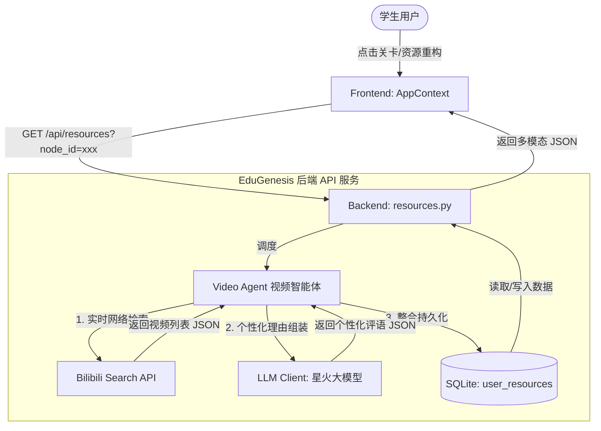

# Bilibili 视频推荐智能体集成设计规范 (Bilibili Video Recommendation Agent Spec)

本项目旨在为 EduGenesis 自适应多智能体教学系统引入“精品视频推荐智能体 (Video Recommendation Agent)”，以丰富系统多模态资源包，解决目前讲解视频形态单一简陋的问题。本功能将实时从 Bilibili 检索高相关性的学习视频，并通过 AI 结合学生的认知风格生成个性化推荐语，最终在前端以嵌入式播放器的形态实现高级的闭环学习。

## 1. 业务目标与价值

- **标配多模态资源**：为所有关卡引入“精品视频”资源，成为与 PDF课本、思维脑图、自适应测验并列的标准多模态资源。
- **一站式闭环学习**：在应用内直接通过 Bilibili iframe 播放视频，无需跳转外部浏览器，保留高质感的 neon 拟物化沉浸学习状态。
- **双重保障保障极致体验**：实现实时网络爬取 + AI 个性化理由生成，并内置高质量的静态视频缓存，在离线/反爬风控时 100ms 降级展示。

## 2. 系统架构与数据流

### 2.1 整体架构图


### 2.2 数据格式定义
保存在 SQLite `user_resources` 数据库中 `resource_type='video'` 的 content 数据为一个 JSON 数组：
```json
[
  {
    "bvid": "BV1rpWjevEip",
    "title": "2026最新 Python零基础精讲（第1讲）",
    "pic": "https://i2.hdslb.com/bfs/archive/a979056b1a32012cdd00d48fbc3732d253e30620.jpg",
    "author": "Python官方课程",
    "play": "1671.8万",
    "duration": "39:14",
    "recommend_reason": "该视频采用了大量的“边学边写”代码实操演示，非常符合您的实操编码型认知风格。它能帮助您快速在终端中跑出第一行代码，建立直观的编程反馈。"
  }
]
```

## 3. 详细设计与实现路径

---

### 3.1 后端服务改造

#### [NEW] [video_agent.py](file:///e:/AIproject/EduGenesis/backend/app/video_agent.py)
新增视频智能体模块，封装 Bilibili 搜索与 AI 个性化生成逻辑。
- `search_bilibili_videos(node_title: str) -> list`: 
  - 构造检索词（如 `"Python " + node_title` 或 `"机器学习 " + node_title`）。
  - 调用 `https://api.bilibili.com/x/web-interface/search/all/v2?keyword={keyword}` 接口获取前 4 个视频。
  - 清理标题（用正则 `re.sub(r'<[^>]+>', '', title)` 过滤 `<em>` 标签）。
  - 规范封面图片协议（若为 `//i0.hdslb.com/...` 则补充 `https:` 前缀）。
  - 格式化播放量（如 `play > 10000` 格式化为 `x.xw` 或 `x万`）。
- `generate_video_recommendations(videos: list, profile: UserProfile, username: str) -> list`:
  - 调度 LLM，传入当前学生的认知风格（`profile.cognitive_style`）与常见错误范畴。
  - 请求 LLM 为这几个视频快速生成简短的个性化推荐语（每条 40-60 字），告诉学生为什么这个视频适合他的认知风格。
  - 如果大模型服务离线或未配置 Key，使用规则引擎/模板进行快速兜底。

#### [MODIFY] [db.py](file:///e:/AIproject/EduGenesis/backend/app/db.py)
- 更新默认 of `python_path_nodes` 和 `ml_path_nodes` 的 `resources` 配置，将 `"video"` 标配到所有节点的资源项中：
  - 例如：`PathNode(..., resources=["pdf", "code", "video"])`。
- 在 `get_fallback_assets_for_topic` 函数中，为所有章节配置高品质的兜底视频静态数据，防范服务器完全处于无网状态下的初始化留白。

#### [MODIFY] [resources.py](file:///e:/AIproject/EduGenesis/backend/app/routes/resources.py)
- 在 `get_resources` 和 `generate_resources` 中，当解析到 `resources` 包含 `"video"` 时，调用 `video_agent` 执行爬取和生成，并将结果入库持久化。
- 增加控制台日志打印，实时展示“视频推荐智能体”与“画像智能体”的决策日志，以突显多智能体实时协同的学术氛围。

---

### 3.2 前端界面改造

#### [MODIFY] [ResourcesView.jsx](file:///e:/AIproject/EduGenesis/frontend/src/components/dashboard/ResourcesView.jsx)
- 在资源库列表里新增“精品学习视频”卡片，并使用 Lucide 图标 `PlayCircle`，搭配亮粉色（Bilibili 经典粉色 `var(--accent-pink)`）或渐变呼吸边框。
- 点击卡片时调用 `setActiveModal('video')`。

#### [NEW] [VideoModal.jsx](file:///e:/AIproject/EduGenesis/frontend/src/components/modals/VideoModal.jsx)
新增玻璃拟物化暗色系视频学习弹窗：
- **内嵌播放器**：使用 `iframe` 嵌入 Bilibili 官方播放组件：
  `https://player.bilibili.com/player.html?bvid={bvid}&page=1&high_quality=1&as_wide=1`。
- **个性化理由展示**：上方放置“🧠 画像智能体推荐评语”高亮板块，使用渐变背景和精致的呼吸动效，并显示“画像匹配度: 98%”等画像标志。
- **多视频切换边栏/底部网格**：右侧或下方展示搜索到的其他 3 个视频的卡片（封面图、标题、UP主、播放量），点击任何一个卡片，播放器即无缝切换到对应的 Bvid 视频。
- **外链跳出**：下方提供“在Bilibili打开原视频”的直达按钮。

---

### 3.3 容错与降级设计 (Resilience)

- **反爬/网络超时兜底**：如果 Bilibili 接口在 3 秒内未响应或被拦截，自动从 `db.py` 里的静态配置中读取预存的 B站真实高质量教程数据（如：B站最著名的“黑马程序员Python入门”或“吴恩达机器学习”经典 BV号及封面），保证界面在任何极端情况下都能秒开且内容真实有效。
- **AI 离线兜底**：若大模型无法响应，根据用户当前的认知风格，在后端通过拼接模板生成标准的推荐文案（例如：“实操编码型：该视频包含丰富的环境搭建实操，能带您快速动手练习，建议配合左侧沙盒边学边码。”）。

## 4. 验证与测试方案

### 4.1 接口验证
- 启动后端服务后，访问 `http://127.0.0.1:8000/api/resources?node_id=node2`，检查返回的数据中是否包含 `"video"` 数组，且结构与设计一致。
- 模拟关闭网络或删除大模型 Key，验证数据是否能极速降级到本地 fallback 数据。

### 4.2 UI 交互测试
- 点击“精品学习视频”卡片，验证 `VideoModal` 弹窗是否正常弹出。
- 验证 `iframe` 播放器是否可以正常加载并播放 B站视频。
- 点击备选视频卡片，验证播放器是否顺利切换，且推荐评语及匹配度随之刷新。
